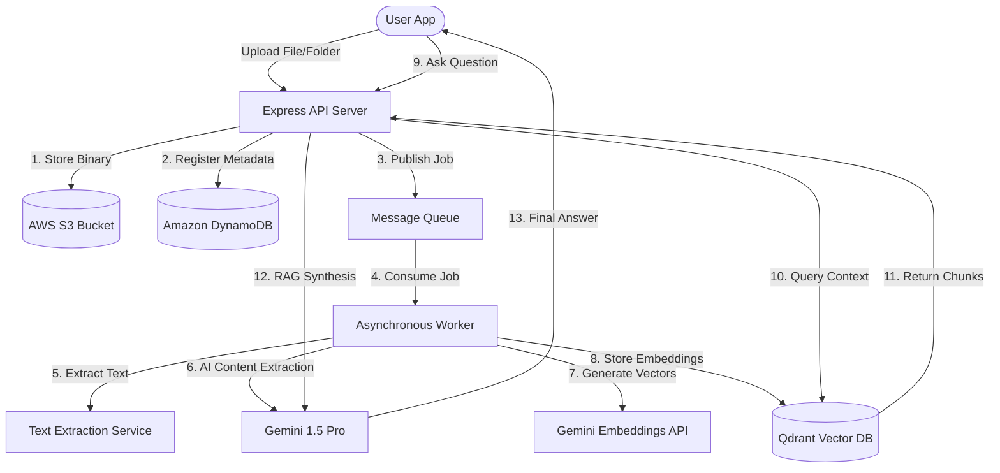

# Chunkly: The AI-Powered Knowledge Assistant & Document Warehouse
### *Enterprise-Grade Cognitive Document Management System*

Chunkly transforms static files into dynamic, searchable, and interactive knowledge assets. Built on a cutting-edge serverless architecture combining **AWS S3**, **DynamoDB**, **Qdrant Vector DB**, and **Google Gemini 1.5 Pro**, Chunkly represents the future of smart document storage and automated insights.

---

## 🚀 The Value Proposition
Organizations waste up to **20% of their working hours** searching for information buried inside PDFs, spreadsheets, and folders. Chunkly eliminates this friction by indexing, understanding, and summarizing every file automatically the moment it is uploaded.

> [!IMPORTANT]
> **Key Metric**: 0% time spent indexing. Every document uploaded to Chunkly is instantly processed by an asynchronous queue, extracted, tagged, and made fully conversational in under 30 seconds.

---

## 🛠️ System Architecture

Chunkly is engineered for high scalability, fault tolerance, and secure data flow.

---

## 🌟 Core Features & Buyer Pitch

### 1. Intelligent, Multi-Stage Ingestion Pipeline
When files or entire folders are uploaded, Chunkly triggers a serverless processing job with automatic retry policies:
* **Automatic Text Extraction**: Decodes documents directly from S3.
* **Semantic Chunking**: Intelligent splitting of texts to preserve contextual integrity.
* **AI Analysis**: Extracts key topics, lists of entities, and auto-generates descriptive tags.

### 2. Conversational RAG (Retrieval-Augmented Generation)
Users can chat with a single file, a folder, or their entire document repository. 
* **Zero Hallucination**: Answers are strictly grounded in the document context.
* **Smart Scope Filtering**: Switch conversation context from a single invoice to an entire directory instantly.

### 3. Proactive Smart Insights & Deadline Extraction
Chunkly doesn't just wait for queries; it reads ahead.
* **Automatic Deadline Extraction**: Identifies due dates, contract renewals, and project timelines within PDFs/Docs.
* **Actionable Insights Feed**: Surfaces upcoming tasks chronologically on the dashboard.
* **Storage Analytics**: Monitored storage capacity and file upload velocity metrics.

### 4. Enterprise Security, Collaboration & Audit Trail
Built for security-first organizations:
* **Granular Access Control**: Share files with specific users with read, write, or download permissions.
* **Audit Trail**: Every upload, download, rename, share, and delete action is recorded in the DynamoDB `ACTIVITY_TABLE` for compliance auditing.
* **Secure File Vault**: Soft-deleted files go to a secure recovery vault (`TrashTable`) before permanent S3 purging.

---

## 📊 Technical Stack Overview

| Component | Technology | Benefit |
| :--- | :--- | :--- |
| **Backend Framework** | Node.js / Express / Bun | Ultra-fast execution, low latency, and modern ES module support. |
| **Databases** | AWS DynamoDB & Qdrant Vector DB | High-scale metadata indexing combined with state-of-the-art semantic search. |
| **Cloud Storage** | Amazon S3 | Durable, secure, and infinitely scalable document repository. |
| **AI/LLM Engine** | Google Gemini (1.5 Pro & Text Embeddings) | State-of-the-art reasoning, document understanding, and vector generation. |
| **Task Queue** | Queue-based Worker Model | Non-blocking file processing ensuring seamless user experience. |

---

> [!TIP]
> **Strategic Acquisition Value**: Chunkly is designed as a plug-and-play white-label solution. Its API-first architecture can be integrated into any existing CRM, ERP, or intranet in less than a day, immediately upgrading the product offering to an AI-first collaborative workspace.
